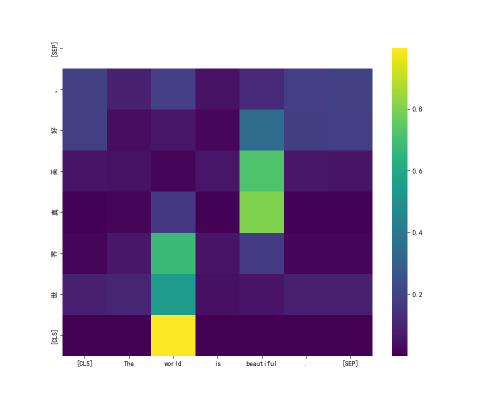

# PR-AAYN-

# Transformer-NMT-Reproduction (EN-CN) 🚀

**A concise PyTorch reproduction of "Attention Is All You Need".**
_从零开始的 Transformer 英中翻译复现项目_

---

## 🛠️ Core Modules | 核心模块

| File        | Responsibility    | 职责                         |
| :---------- | :---------------- | :--------------------------- |
| `blocks.py` | Attention & PE    | 基础组件（注意力、位置编码） |
| `model.py`  | Encoder & Decoder | 模型架构（编码器、解码器）   |
| `utils.py`  | Data & Warmup     | 数据处理与学习率预热         |

## 🌟 Highlights | 项目亮点

- **Pure PyTorch**: No high-level wrappers, 100% logic visibility. (全原生实现)
- **Deep Optimization**:
  - ✅ **Label Smoothing** (0.1) to boost generalization.
  - ✅ **Noam Scheduler** (Warmup) for stable convergence.
- **Hardware**: Trained on **RTX 5090**, verified on **RTX 4060**.

## 📊 Results | 结果展示

> "The world is beautiful" -> **"世界真美好。"**

- **Epochs**: 80 (Final)
- **Final Loss**: ~0.5 (with Smoothing)
- **Status**: Stable & Inference-ready.

### Attention Alignment (注意力对齐)

The following heatmap shows how the model "focuses" on specific English words when generating Chinese characters.
下图展示了模型在生成中文字符时，是如何“聚焦”在特定的英文单词上的。

## 🚀 Quick Start | 快速开始

1. **Train**: `python main.py` (Ensure `data/train_cmn.txt` exists)
2. **Test**: Run `main.py` in inference mode to translate your sentences.

---

_Created by griffin & Gemini._
